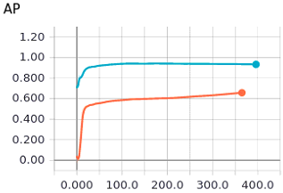
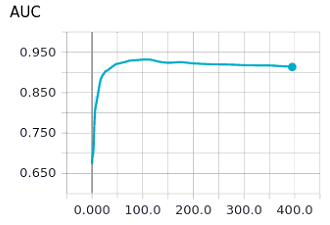
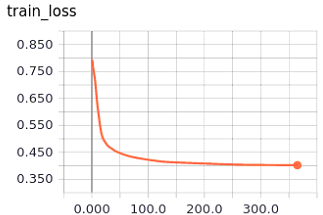
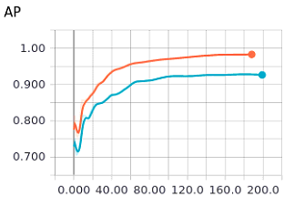
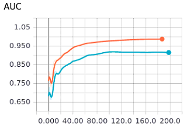
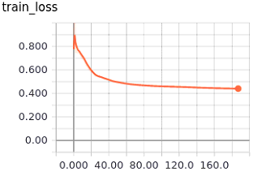

# The implement of [Variational Graph Auto-Encoders](https://arxiv.org/pdf/1611.07308.pdf)

## 1. Data format
### 1.1 Cora
|file|shape|content|
|:---:|:---:|:---:|
|ind.cora.x|(140, 1442)|?| 
|ind.cora.tx|(1000, 1433)|feature vectors of test samples| 
|ind.cora.allx|(1708, 1433)|feature vectors of train samples|
|ind.cora.graph|(2708, 2708)|adjacency matrix for links|
|ind.cora.text.index|(1000, 1)|indexs of test samples on graph|

## 2. Performance
### 2.1 performance on Cora
#### 2.1.1 accuracy table
|method|AUC|AP|
|:---:|:---:|:---:|
|GAE|0.9047|0.91322|
|VGAE|||

### 2.1.2 visualization of training process for GAE
**Remark**: 1)blue lines represent validation; 2)orange lines represent train.

**Problem**: It is strange that training accuracy is lower than validating accuracy. I guess the reason is owed to different evaluation strategy. During validation the rate for positive samples and negative samples is 1:1, while during traing the rate is much lower.

When we modify the code and fix the rate for positive and negative samples to 1:1 during training accuracy computing, the problem is addressed. The details are summarized as follows:

## 3. Ablation study
### 3.1 Influence of "pos_weight" (postive weight) used in loss computation
|model|pos_weight|AUC|AP|
|:---:|:---:|:---:|:---:|
|GAE|original value (about 815)|0.9047|0.91322|
|GAE|1.0|0.5047|0.5047|
|GAE|50.0|0.5476|0.5482|
|GAE|200.0|0.9202|0.9336|
|GAE|400.0|0.9188|0.9301|
|GAE|800.0|0.9146|0.9290|    

## Log
- [] modify the code for training accuracy computation, in which the positive and negative samples are fixed to 1:1
